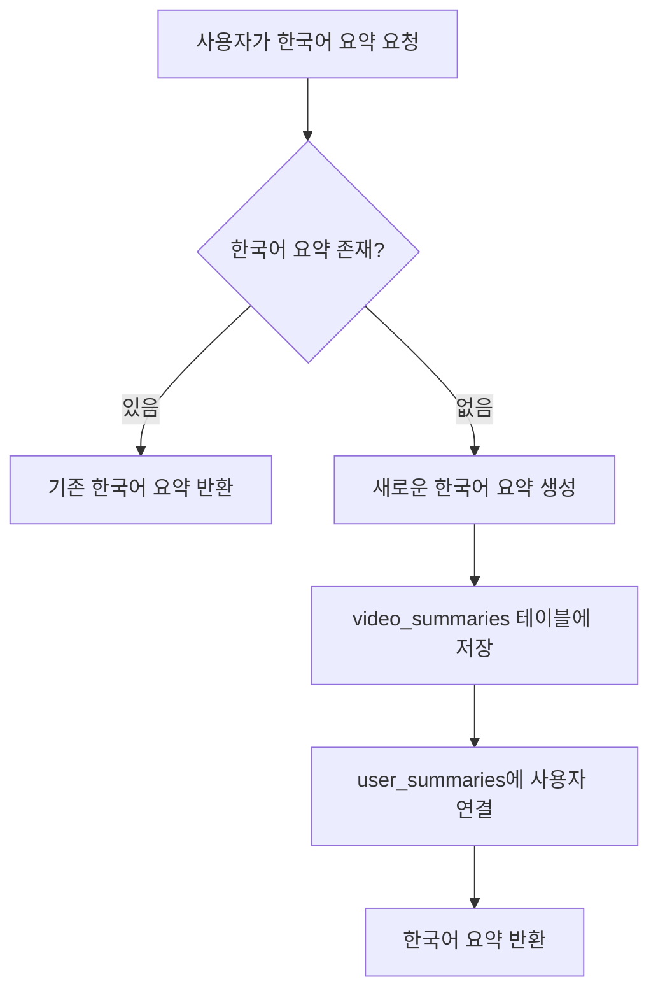

# 🌍 언어별 요약 저장 시스템 - 데이터베이스 구조 설명

## 📋 개요
한 영상에 대해 여러 언어로 요약을 저장하고 관리할 수 있는 시스템의 데이터베이스 구조를 설명합니다.

---

## 🗄️ 주요 테이블 구조

### 1. `video_summaries` (영상 요약 메인 테이블)

```sql
CREATE TABLE video_summaries (
  id UUID DEFAULT gen_random_uuid() PRIMARY KEY,
  user_id UUID REFERENCES auth.users(id) ON DELETE CASCADE,
  video_id VARCHAR(255) NOT NULL,
  video_title TEXT NOT NULL,
  video_thumbnail TEXT,
  video_duration VARCHAR(50),
  channel_title TEXT,
  video_tags TEXT[],
  video_description TEXT,
  inferred_topics TEXT[],
  inferred_keywords TEXT[],
  summary TEXT NOT NULL,
  summary_prompt TEXT,
  dialog JSONB,  -- 영상 자막/대화 원본 데이터
  language VARCHAR(10) DEFAULT 'en' NOT NULL,  -- 🆕 요약 언어
  created_at TIMESTAMP WITH TIME ZONE DEFAULT NOW(),
  updated_at TIMESTAMP WITH TIME ZONE DEFAULT NOW(),
  
  -- 🔑 핵심: 동일 영상의 동일 언어 요약은 하나만 허용
  CONSTRAINT unique_video_language_summary UNIQUE (video_id, language)
);
```

#### 주요 필드 설명
| 필드명 | 타입 | 설명 | 예시 |
|--------|------|------|------|
| `video_id` | VARCHAR(255) | YouTube 영상 ID | `dQw4w9WgXcQ` |
| `language` | VARCHAR(10) | 요약 언어 코드 | `ko`, `en`, `ja` |
| `summary` | TEXT | 해당 언어로 생성된 요약 내용 | 한국어 요약 텍스트 |
| `dialog` | JSONB | 영상의 원본 자막 데이터 | `[{"text": "Hello", "start": 1.0}]` |

#### 🔗 제약 조건
- **UNIQUE(video_id, language)**: 같은 영상의 같은 언어 요약은 하나만 존재
- 예: 영상 `ABC123`의 한국어(`ko`) 요약은 DB에 하나만 저장됨

---

### 2. `user_summaries` (사용자-요약 연결 테이블)

```sql
CREATE TABLE user_summaries (
  id UUID DEFAULT gen_random_uuid() PRIMARY KEY,
  user_id UUID REFERENCES auth.users(id) ON DELETE CASCADE,
  summary_id UUID REFERENCES video_summaries(id) ON DELETE CASCADE,
  preferred_language VARCHAR(10) DEFAULT 'en',  -- 🆕 사용자가 선호하는 언어
  created_at TIMESTAMP WITH TIME ZONE DEFAULT NOW(),
  
  -- 사용자별 중복 요약 연결 방지
  UNIQUE(user_id, summary_id)
);
```

#### 역할
- 사용자가 어떤 요약에 접근할 수 있는지 관리
- 다대다(Many-to-Many) 관계: 한 사용자는 여러 요약을, 한 요약은 여러 사용자가 접근 가능

---

### 3. `user_preferences` (사용자 언어 설정 테이블)

```sql
CREATE TABLE user_preferences (
  id UUID DEFAULT gen_random_uuid() PRIMARY KEY,
  user_id UUID REFERENCES auth.users(id) ON DELETE CASCADE,
  preferred_language VARCHAR(10) DEFAULT 'en' NOT NULL,
  created_at TIMESTAMP WITH TIME ZONE DEFAULT NOW(),
  updated_at TIMESTAMP WITH TIME ZONE DEFAULT NOW(),
  
  -- 사용자당 하나의 설정만 허용
  UNIQUE(user_id)
);
```

#### 역할
- 사용자별 기본 언어 설정 저장
- 언어 선택기에서 선택한 언어가 여기에 저장됨

---

## 🚀 핵심 인덱스

### 성능 최적화를 위한 인덱스들

```sql
-- 1. 언어별 요약 검색 최적화
CREATE INDEX idx_video_summaries_video_id_language 
ON video_summaries(video_id, language);

-- 2. 언어별 + 시간순 정렬 최적화
CREATE INDEX idx_video_summaries_video_id_language_created 
ON video_summaries(video_id, language, created_at DESC);

-- 3. 언어별 필터링 최적화
CREATE INDEX idx_video_summaries_language 
ON video_summaries(language);

-- 4. 사용자별 언어 선호도 검색 최적화
CREATE INDEX idx_user_summaries_user_language 
ON user_summaries(user_id, preferred_language);
```

---

## 🔧 핵심 데이터베이스 함수들

### 1. `get_summary_with_language_fallback` 함수

```sql
-- 언어 폴백 로직으로 요약 조회
-- 우선순위: 요청 언어 → 영어 → 아무 언어 → null
SELECT * FROM get_summary_with_language_fallback('dQw4w9WgXcQ', 'ko');
```

#### 폴백 순서
1. **요청한 언어** (예: 한국어 `ko`)
2. **영어** (`en`) - 디폴트 언어
3. **사용 가능한 아무 언어**
4. **null** - 요약 없음

### 2. `get_available_languages_for_video` 함수

```sql
-- 특정 영상에서 사용 가능한 모든 언어 조회
SELECT * FROM get_available_languages_for_video('dQw4w9WgXcQ');
```

#### 반환 정보
- `language`: 언어 코드
- `summary_count`: 해당 언어의 요약 개수
- `latest_created_at`: 최근 생성 시간

### 3. `summary_exists_for_language` 함수

```sql
-- 특정 영상의 특정 언어 요약 존재 여부 확인
SELECT summary_exists_for_language('dQw4w9WgXcQ', 'ko');
```

---

## 📊 데이터 흐름 예시

### 시나리오: 사용자가 한국어로 요약 요청



### 실제 데이터 예시

#### 1. 영상 `ABC123`에 대한 다국어 요약 저장
```sql
-- 영어 요약
INSERT INTO video_summaries (video_id, language, summary, user_id) 
VALUES ('ABC123', 'en', 'This is an English summary...', user1_id);

-- 한국어 요약  
INSERT INTO video_summaries (video_id, language, summary, user_id)
VALUES ('ABC123', 'ko', '이것은 한국어 요약입니다...', user2_id);

-- 일본어 요약
INSERT INTO video_summaries (video_id, language, summary, user_id)
VALUES ('ABC123', 'ja', 'これは日本語の要約です...', user3_id);
```

#### 2. 폴백 로직 동작 예시
```sql
-- 사용자가 중국어(zh) 요약 요청했지만 없는 경우
SELECT * FROM get_summary_with_language_fallback('ABC123', 'zh');

-- 결과: 영어 요약 반환 (is_fallback = true)
-- {
--   "summary": "This is an English summary...",
--   "language": "en", 
--   "found_language": "en",
--   "is_fallback": true
-- }
```

---

## ⚡ 성능 최적화 특징

### 1. **중복 방지**
- `UNIQUE(video_id, language)` 제약으로 동일 언어 요약 중복 생성 방지
- AI API 호출 비용 절약

### 2. **인덱스 최적화**
- 복합 인덱스로 언어별 검색 성능 향상
- 시간순 정렬까지 포함한 인덱스로 최신 요약 빠른 조회

### 3. **효율적인 폴백**
- 데이터베이스 함수 레벨에서 폴백 처리
- 애플리케이션 코드 단순화

### 4. **확장성**
- 새로운 언어 추가 시 기존 구조 변경 없이 가능
- 언어별 독립적인 요약 관리

---

## 🔒 보안 및 권한 관리

### Row Level Security (RLS) 정책

```sql
-- 사용자는 자신의 요약만 수정 가능
CREATE POLICY "Users can update their own summaries" ON video_summaries
  FOR UPDATE USING (auth.uid() = user_id);

-- 모든 사용자는 모든 요약 조회 가능 (공개)
CREATE POLICY "Users can view all summaries" ON video_summaries
  FOR SELECT USING (true);
```

### 접근 권한 체계
- **생성**: 인증된 사용자만 요약 생성 가능
- **조회**: 모든 사용자가 모든 요약 조회 가능
- **수정**: 요약 작성자만 수정 가능
- **삭제**: 요약 작성자만 삭제 가능

---

## 📈 확장 가능성

### 향후 확장 방향
1. **언어별 요약 품질 점수** 추가
2. **사용자별 언어 선호도 학습** 기능
3. **언어별 요약 스타일** 차별화
4. **실시간 번역** 기능 통합
5. **언어별 키워드 추출** 개선

이 구조를 통해 YouTube 요약 서비스가 다국어 사용자들에게 최적화된 경험을 제공할 수 있습니다! 🚀